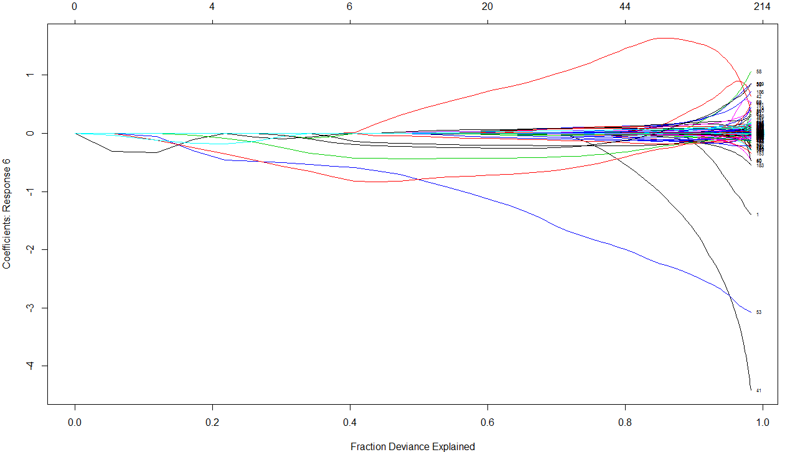
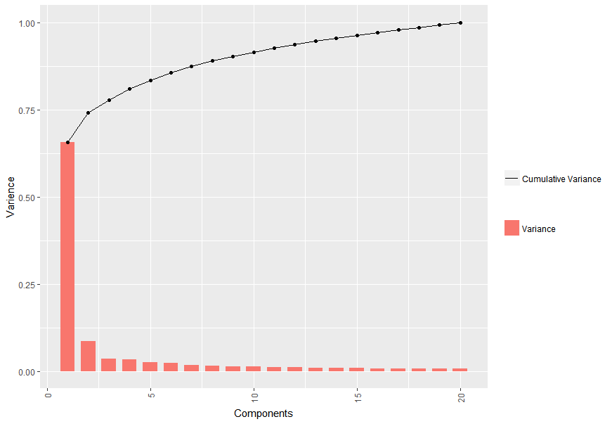
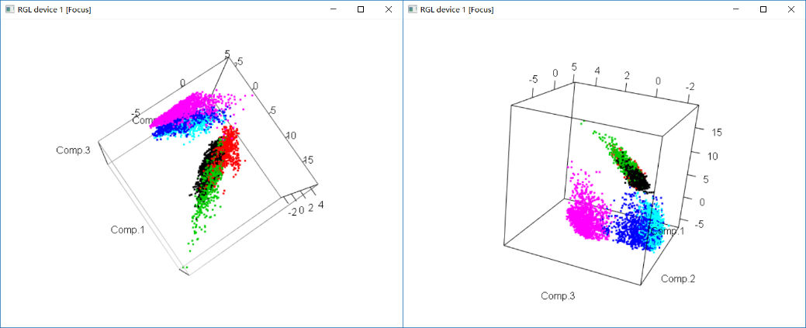
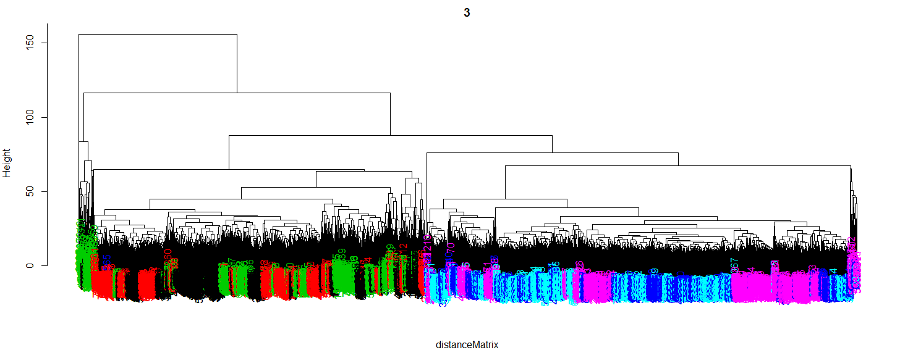
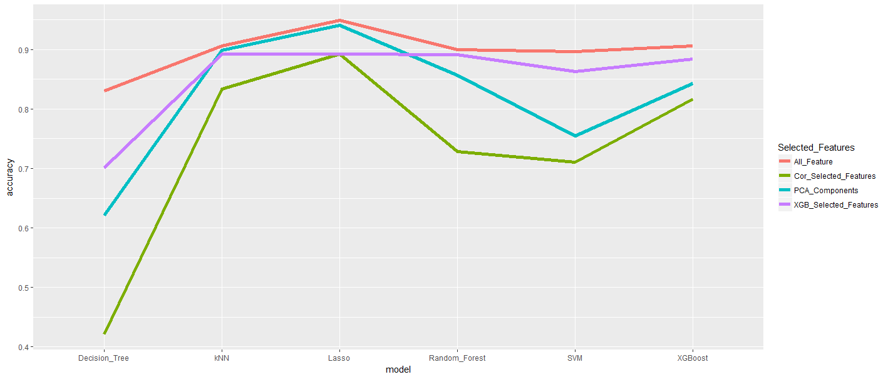

Human Activity Recognition
----------

 - [数据读取/清理](#readdata)
 - [特征工程](#featureEngineering)
     - [相关系数](#correlation)
     - [Lasso](#las_features)
     - [xgboost](#xgb_features)
     - [PCA降维](#pca)
 - [建模](#modeling)
    - [Decision Tree](#decisionTree)
    - [Logistic Regression](#logisticRegression)
    - [Lasso](#lasso)
    - [Random Forest](#randomForest)
    - [Gradien Boost](#xgb)
    - [SVM](#svm)
    - [KNN](#knn)
 - [结果&可视化](#conclusion)
 - [Further Work](#furtherWork)


<span id="readdata">数据读取/清理</span> 
--------
需要用到的包
```R
library("data.table")
library("RCurl")
library("tidyr")
```

**下载并解压数据包**
```R
setwd("./GitHub/Human_Activity_Recognition_with_Smartphones")
url<- "https://d396qusza40orc.cloudfront.net/getdata%2Fprojectfiles%2FUCI%20HAR%20Dataset.zip"
path <- as.character(getwd())
f <- "Dataset.zip"
path_data <- file.path(path, "UCI HAR Dataset")
if(!file.exists(path)){
  dir.create(path)
}
if(!file.exists(f)){
  download.file(url, file.path(path, f))
}
executable  <- file.path("C:","Program Files", "7-Zip", "7z.exe")
parameters <- "x"
cmd <- paste(paste0("\"", executable, "\""), parameters, paste0("\"", file.path(path, f), "\""))
system(cmd)
if(!file.exists(path_data)){
  dir.create(path_data)
}

```

读取各个文件。这里对几个文件进行简单的介绍：

 - X_train, X_test 总共有10000+记录，每条数据包含手机传感器手机561个不同特征数值。
 - Y_train, Y_test总共有10000+记录，每条数据包含每条记录对应的运动（walking，sitting，laying等6个）
 - subject_train.txt, subject_test.txt总共有10000+记录，代表每条数据来自的被试编号。一共有30名被试

```R
dtSubjectTrain <- fread(file.path(path_data, "train", "subject_train.txt"))
dtSubjectTest <- fread(file.path(path_data, "test", "subject_test.txt"))
dtActivityTrain <- fread(file.path(path_data, "train", "Y_train.txt"))
dtActivityTest <- fread(file.path(path_data, "test", "Y_test.txt"))
#The input data(x data) in format "ANSI",can't read by "fread"
#Use data table to read the file
fileToDataTable <- function(f) {
  df <- read.table(f)
  dt <- data.table(df)
}
dtTrain <- fileToDataTable(file.path(path_data, "train", "X_train.txt"))
dtTest <- fileToDataTable(file.path(path_data, "test", "X_test.txt"))
```
由于给的X文件不是ASCII编码，这里需要使用data.tale来读取

**数据整合（用于统计分析）**

将数据整合，可用于统计分析。
```R
#combine data frames
setnames(dtSubjectTrain, "V1", "subject")
setnames(dtSubjectTest, "V1", "subject")
setnames(dtActivityTrain, "V1", "activityNum")
setnames(dtActivityTest, "V1", "activityNum")

dtplot_train <- cbind(dtSubjectTrain, dtTrain, dtActivityTrain)
dtplot_test <- cbind(dtSubjectTest, dtTest, dtActivityTest)
dtplot <- rbind(dtplot_train, dtplot_test)
setkey(dtplot_Train, subject, activityNum)
setkey(dtplot_Test, subject, activityNum)


#read activity and feature Name
dtActivityNames <- fread(file.path(path_data, "activity_labels.txt"))
dtFeatures <- fread(file.path(path_data, "features.txt"))
setnames(dtActivityNames, names(dtActivityNames), c("activityNum", "activityName"))
setnames(dtFeatures, names(dtFeatures), c("featureNum", "featureName"))
dtFeatures$featureCode <- dtFeatures[, paste0("V", featureNum)]


#Label the data 
dtplot <- merge(dtplot, dtActivityNames, by = "activityNum", all.x = TRUE)
dtplot <- data.table(melt(dtplot, key(dt), variable.name = "featureCode"))
dtplot <- merge(dtplot, dtFeatures[, list(featureNum, featureCode, featureName)], by = "featureCode", all.x = TRUE)

dtplot$activity <- factor(dtplot$activityName)
dtplot$feature <- factor(dtplot$featureName)

#see the dtplot
head(dtplot)

##featureCode activityName     value featureNum       featureName activity           feature
##1:          V1      WALKING 0.2820216          1 tBodyAcc-mean()-X  WALKING tBodyAcc-mean()-X
##2:          V1      WALKING 0.2558408          1 tBodyAcc-mean()-X  WALKING tBodyAcc-mean()-X
##3:          V1      WALKING 0.2548672          1 tBodyAcc-mean()-X  WALKING tBodyAcc-mean()-X
##4:          V1      WALKING 0.3433705          1 tBodyAcc-mean()-X  WALKING tBodyAcc-mean()-X
##5:          V1      WALKING 0.2762397          1 tBodyAcc-mean()-X  WALKING tBodyAcc-mean()-X
##6:          V1      WALKING 0.2554682          1 tBodyAcc-mean()-X  WALKING tBodyAcc-mean()-X
```


<span id="featureEngineering">特征工程</span> 
------------------------
**特征清理**

 - Feature Scaling。如图，feature 范围差异不大，数值上下边界之差都在[1,2]


 - 缺失值。数据集中不存在缺失值。
```R
sum(is.na(dtTrain))
sum(is.na(dtTest))
sum(is.na(dtActivityTrain))
sum(is.na(dtActivityTest))

#> sum(is.na(dtTest))
#[1] 0
#> sum(is.na(dtTrain))
#[1] 0
#> sum(is.na(dtTest))
#[1] 0
#> sum(is.na(dtActivityTrain))
#[1] 0
#> sum(is.na(dtActivityTest))
#[1] 0
```

**特征选择**
数据集中国输入数据为561维，为了提高学习速率以及防止过拟合，可以进行特征选择。常用的特征选择方法包括以下3类。

     1. Filter：利用自变量/因变量关系进行筛选。如：相关系数、卡方检验、互信息
     2. Wrapper： 根据目标函数迭代决定是否加入变量。如REF、LVW
     3. Embedded： 学习自身自动选择特征。正则化、决策树、深度学习

 根据训练成本选择了相关系数，抉择树，正则化三种特征选择方法。


 - **<span id="correlation">相关性 - Feature Selection</span>**
```R
shighlyCorrelated <- findCorrelation(dtTrain, cutoff = 0.5)
cor_selected <- setdiff(c(1:561),highlyCorrelated)
dtTrain_cor <- dtTrain[, cor_selected, with = FALSE]
system.time(highlyCorrelated <- findCorrelation(dtTrain, cutoff = 0.5))
```
以下是具有较高相关性的特征，33个；运算时间0.34s
```R
## [1] "V2"   "V3"   "V29"  "V30"  "V31"  "V33"  "V35"  "V36"  "V43"  "V81"  "V82"  "V83"  "V111" "V115"
##[15] "V117" "V119" "V121" "V122" "V123" "V147" "V152" "V153" "V161" "V162" "V163" "V187" "V191" "V192"
##[29] "V195" "V237" "V264" "V295" "V561"
```
 - **<span id="las_features">Lasso特征选择</span>**

lasso是用来做特征选择的一种常用方式，lasso回归能够将不重要的feature系数降到0，来达到特征筛选的目的。lasso进行特征选择需要花费很长时间。
```R
fit <- glmnet(x, y, family = "multinomial", type.multinomial = "grouped")
cvfit <- cv.glmnet(x, y, family="multinomial", type.multinomial = "grouped", parallel = TRUE)
plot(fit, xvar = "lambda", label = TRUE, type.coef = "2norm")
plot(fit, xvar = "dev", label = TRUE)
plot(cvfit)
```
如图，随着惩罚力度lamda增大，更多的feature参数降为0，同时剩余feature所能反映矩阵差异性降低（更多信息丢失）。
```R
##[27,]  44  8.012e-01 0.0371300
##[28,]  43  8.124e-01 0.0338300
##[29,]  46  8.228e-01 0.0308300
##[30,]  48  8.327e-01 0.0280900
##[31,]  51  8.421e-01 0.0255900
##[32,]  54  8.509e-01 0.0233200
##[33,]  57  8.592e-01 0.0212500
##[34,]  59  8.674e-01 0.0193600
##[35,]  64  8.750e-01 0.0176400
##[36,]  67  8.823e-01 0.0160700
##[37,]  69  8.892e-01 0.0146500
##[38,]  73  8.957e-01 0.0133400
##[39,]  79  9.018e-01 0.0121600
##[40,]  82  9.075e-01 0.0110800
##[41,]  84  9.129e-01 0.0100900
##[42,]  84  9.179e-01 0.0091980
##[43,]  83  9.225e-01 0.0083810
##[44,]  84  9.267e-01 0.0076360
##[45,]  87  9.308e-01 0.0069580
##[46,]  88  9.346e-01 0.0063400
##[47,]  95  9.382e-01 0.0057770
##[48,]  99  9.416e-01 0.0052630
```
通过cross validation我们找到最佳的lamda值
如图，lamda值没有在区间内实现收敛，我们可以根据对信息丢失比率、feature数量综合选择合适的lamda。
```R


```



如图，lamda值没有在区间内实现收敛，lasso在本样本中未能帮助我们实现特征的选择。

 - **<span id="xgb_features">Xgboost特征选择</span>**

Xgboost迭代树模型会在结果中返回feature importance用来评估feature的重要性
```R
##Xgboost要求label为[0, num_class),需要对label进行变换
y <- as.integer(y)-1
bst <- xgboost(data = x, label = y, max_depth = 2,eta = 1, nthread = 2, nround = 2, objective = "multi:softmax",num_class = 6)
importance_matrix <- xgb.importance(colnames(x), model = bst)
xgb.plot.importance(importance_matrix, rel_to_first = TRUE, xlab = "Relative importance")
```
xgb给出了24个feature
```R
    Feature         Gain       Cover  Frequency   Importance
##1:      52 3.339117e-01 0.107424262 0.09090909 3.339117e-01
##2:       9 1.195970e-01 0.058808401 0.03030303 1.195970e-01
##3:     166 6.402276e-02 0.058808401 0.03030303 6.402276e-02
##4:     503 6.361947e-02 0.019661487 0.03030303 6.361947e-02
##5:     559 5.902949e-02 0.072965819 0.06060606 5.902949e-02
##6:      41 5.763800e-02 0.019517506 0.03030303 5.763800e-02
##7:      73 5.489628e-02 0.018805603 0.03030303 5.489628e-02
##8:     296 5.372150e-02 0.070433328 0.06060606 5.372150e-02
##9:     330 5.058250e-02 0.058808401 0.03030303 5.058250e-02
##10:     138 1.857048e-02 0.032797558 0.03030303 1.857048e-02
##11:     504 1.824142e-02 0.079078355 0.06060606 1.824142e-02
##12:     316 1.766929e-02 0.031412455 0.03030303 1.766929e-02
##13:     450 1.725781e-02 0.033200706 0.03030303 1.725781e-02
##14:      53 1.648627e-02 0.061175544 0.06060606 1.648627e-02
##15:     129 1.372205e-02 0.033525529 0.03030303 1.372205e-02
##16:     159 7.861922e-03 0.007687002 0.03030303 7.861922e-03
##17:      38 7.757756e-03 0.039290838 0.03030303 7.757756e-03
##18:     247 4.632922e-03 0.039146856 0.03030303 4.632922e-03
##19:     132 4.547671e-03 0.012913273 0.03030303 4.547671e-03
##20:     426 3.972921e-03 0.035931460 0.03030303 3.972921e-03
##21:     526 2.808696e-03 0.020287317 0.03030303 2.808696e-03
##22:     451 2.561873e-03 0.018313935 0.03030303 2.561873e-03
##23:     369 2.170819e-03 0.018191896 0.03030303 2.170819e-03
##24:      57 2.006562e-03 0.009764944 0.03030303 2.006562e-03
##25:     371 1.733329e-03 0.017255037 0.03030303 1.733329e-03
##26:     126 9.773375e-04 0.015211709 0.03030303 9.773375e-04
##27:     270 2.087210e-06 0.009582375 0.03030303 2.087210e-06
##    Feature         Gain       Cover  Frequency   Importance
```
Feature相对重要性如下图


**<span id="pca">PCA 降维 </span>**
pca通过奇异矩阵分解的方式，获得主成分。通过少量的主成分代表所有的festures
```R
pca_train <- princomp(dtTrain)
pca_test <- princomp(dtTest)

pca_train.variance.explained = pca_train$sdev[1:20]^2 / sum(pca_model$sdev[1:20]^2)
pca_train_component20 <- data.frame(component = c(1:20), Variance = pca_train.variance.explained, Variance_Cumulation = cumsum(pca_train.variance.explained))

ggplot(data=pca_train_component20, aes(x=component)) + 
  geom_bar(aes(y=Variance,fill="Variance"), width=.7, stat="identity") +
  geom_line(aes(y=Variance_Cumulation, group=1, linetype="Cumulative Variance"))+
  geom_point(aes(y=Variance_Cumulation))+
  xlab("Components") + ylab("Varience") +
  labs(fill="",linetype="")+
  theme(axis.text.x = element_text(angle = 90, hjust = 1, vjust=0.5))
##extrat top3 component for plotting 3D figure
dtTrain_pca3 <- data.frame(pca_train$scores[,1:3])
dtTest_pca3 <- data.frame(pca_test$scores[,1:3])
library(rgl)
with(pca_component_top3,{plot3d(Comp.1, Comp.2, Comp.3, col = dtActivityTrain$activityNum)})
##construct dimensionality reduction data
dtTrain_pca20 <- data.frame(pca_train$scores[,1:20])
dtTest_pca20 <- data.frame(pca_test$scores[,1:20])

```


对top3主成分进行可视化，我们可以观察出：

 - 数据明显分为两大类。紫蓝青 + 黑红绿
 - 紫，红在两个大类中可以被分出
 - 红黑，蓝青被混在一起

通过层次聚类和K-Means聚类。结果和我们通过3D视图获得的结论一直
```R
hclusterplot <- function(data, column){
  distanceMatrix <- dist(data[,column])
  myplclust(hclustering, lab.col = unclass(data$activity), main = as.character(column[length(column)]-1))
}
myplclust <- function(hclust, lab = hclust$labels, lab.col = rep(1,length(hclust$labels)), hang = 0.1, ...){
  y <- rep(hclust$height,2)
  x <- as.numeric(hclust$merge)
  y <- y[which( x < 0 )]
  x <- x[which( x < 0 )]
  x <- abs(x)
  y <- y[order(x)]
  x <- x[order(x)]
  plot(hclust, labels = FALSE, hang = hang, ...)
  text(x = x, y = y[hclust$order] - (max(hclust$height)*hang), labels = lab[hclust$order], col = lab.col[hclust$order], srt = 90, adj = c(1,0.5), xpd = NA, ...  )
}
kclusterplot <- {
  clusterdata <- merge(clusterdata, dtActivityNames, by = "activityNum", all.x = TRUE)
  kClust <- kmeans(clusterdata[2:4],centers = 6, nstart = 100)
  table(kClust$cluster, clusterdata$activityName)
} 
```


```R
#    LAYING SITTING STANDING WALKING WALKING_DOWNSTAIRS WALKING_UPSTAIRS
#  1      6       1        0     431                271              350
#  2    808     748      801       0                  0                0
#  3      0       0        0      82                200               10
#  4     22      15        1     355                122              578
#  5    571     522      572       0                  0                0
#  6      0       0        0     358                393              135
```
从结果看，无论使用层次聚类还是KMeans聚类，都仅能将activity分为两类：静止类：laying，sitting，standing；运动类：walking，walking_downstairs, walking_upstairs.无法提供更多信息。

<span id="modeling">建模</span> 
-----------------
 构建训练数据集
```R
dtTrain_dtActivityTrain <- data.frame(dtTrain, dtActivityTrain) #完整训练集
dtTrain_dtActivityTrain_cor <- data.frame(dtTrain_cor, dtActivityTrain) #相关系数训练集
dtTrain_dtActivityTrain_xgb <- data.frame(dtTrain_xgb, dtActivityTrain) #xgboost训练集
dtTrain_dtActivityTrain_pca20 <- data.frame(dtTrain_pca20, dtActivityTrain) #PCA训练集
```
 
**<span id="decisionTree">Decision Tree</span>** 
```R
decisionTreeModel <- function(xy_train, x_test, y_test){
  runningTime <- system.time(bodyfat_rpart <- rpart(activityNum~., data = xy_train, control = rpart.control(minsplit = 100)))
  opt <- which.min(bodyfat_rpart$cptable[,"xerror"])
  cp <- bodyfat_rpart$cptable[opt, "CP"]
  bodyfat_prune <- prune(bodyfat_rpart, cp = cp)
  DEXfat_pred <- predict(bodyfat_prune, newdata = x_test)
  accuracy <- table(round(DEXfat_pred) == y_test$activityNum)
  return(list(runningTime, accuracy))
}

#1. data with full features 
print(result1 <- decisionTreeModel(dtTrain_dtActivityTrain, dtTest, dtActivityTest))
#2. data with correlation features
result2 <- decisionTreeModel(dtTrain_dtActivityTrain_cor, dtTest, dtActivityTest)
#3. data with xgboost features
result3 <- decisionTreeModel(dtTrain_dtActivityTrain_xgb, dtTest, dtActivityTest)
#4. data with pca20 features
result4 <- decisionTreeModel(dtTrain_dtActivityTrain_pca20, dtTest, dtActivityTest)

```

1,使用完整数据集，Decision Tree正确识别率为83%，训练时间3.7s

```R
##FALSE  TRUE 
##  503  2444 
```


2，使用相关性分析筛选数据集，正确率为42%，训练时间0.5s
```R
##FALSE  TRUE 
## 1677  1270 
```
3,使用xgb筛选数据集，正确率70.1%，训练时间为0.25
```R
#FALSE  TRUE 
#  882  2065 
```
3,使用pca降维数据，正确率62.1%，训练时间为0.19
```R
#FALSE  TRUE 
# 1118  1829 
```
**<span id="logisticRegression">Logistic Regression</span>**
相比于岭回归，lasso对多feature数据集有更好的效果。使用lasso分析获得较好的正确率。
使用lasso筛选数据集，因为通过lasso的数据特征选择并不收敛，因此我们在使用lasso预测分类时，可以使用所有features，即lamda = 0
正确率为94.74%，训练时间2435s
```R
lassoModel <- function(x_train, y_train, x_test, y_test){
  fit <- glmnet(as.matrix(x_train), as.matrix(y_train), family = "multinomial", type.multinomial = "grouped")
  cvfit <- cv.glmnet(as.matrix(x_train), as.matrix(y_train), family="multinomial", type.multinomial = "grouped", parallel = TRUE)
  Lasso_pred <- predict(cvfit,s = 0, newx = as.matrix(x_test), type = "class")
  class(Lasso_pred)
  accuracy <- table(Lasso_pred == y_test$activityNum)
  return(list(runningTime, accuracy))
}
#1. data with full features 
system.time(print(result1 <- lassoModel(dtTrain,dtActivityTrain, dtTest, dtActivityTest)))
#2. data with correlation features
system.time(result2 <- lassoModel(dtTrain_cor, dtActivityTrain, dtTest, dtActivityTest))
#3. data with xgboost features
system.time(result3 <- lassoModel(dtTrain_xgb, dtActivityTrain, dtTest, dtActivityTest))
#4. data with pca80 features
system.time(result4 <- lassoModel(dtTrain_pca80, dtActivityTrain, dtTest_pca80, dtActivityTest))

```
如图，lasso算法不能在特征子集中找到更好的子集。因此，我们可以认为任意特征子集都不能得到优于使用全部特征的分类器。


**使用完整数据集,正确率为94.94%，训练时间4046s**
```
##FALSE  TRUE 
##  149  2798 
```
使用相关系数数据集，正确率86.1%，训练时间1838s
```R
##FALSE  TRUE 
## 411  2536 
```
使用xgb数据集，正确率86.3%，训练时间694s
```R
##FALSE  TRUE 
##  402  2545 
```
使用pca数据集，正确率94.1%，训练时间1976s
```R
##FALSE  TRUE 
##  173  2774 
```


**<span id="randomForest">Random Forest</span>**
```R
randomForestModel <- function(xy_train, x_test, y_test){
  model <- randomForest(activityNum~., data = xy_train)
  RF_pred <- predict(model, newdata = x_test)
  accuracy <- table(round(RF_pred) == y_test$activityNum)
  return(accuracy)
}
#1. data with full features 
system.time(result1 <- randomForestModel(dtTrain_dtActivityTrain, dtTest, dtActivityTest))
#2. data with correlation features
system.time(result2 <- randomForestModel(dtTrain_dtActivityTrain_cor, dtTest_cor, dtActivityTest))
#3. data with xgboost features
system.time(result3 <- randomForestModel(dtTrain_dtActivityTrain_xgb, dtTest_xgb, dtActivityTest))
#4. data with pca80 features
system.time(result4 <- randomForestModel(dtTrain_dtActivityTrain_pca80, dtTest_pca80, dtActivityTest))


```
使用完整数据集正确率为90.0%， 训练时间706s
```
##FALSE  TRUE 
##  296  2651
```
使用相关系数数据集正确率为72.8%, 训练时间156s
```R
##FALSE  TRUE 
##  802  2145
```
使用xgb数据集正确率为89.1%, 训练时间125s
```R
##FALSE  TRUE 
##  320  2627
```
使用pca数据集正确率为85.7%, 训练时间122s
```R
##FALSE  TRUE 
##  422  2525
```

**<span id="xgb">Gradient Boost</span>**
```R
XgboostModel <- function(x_train, y_train, x_test, y_test){
  y <- as.integer(y_train$activityNum)-1
  bst <- xgboost(data = as.matrix(x_train), label = y, max_depth = 3,eta = 0.32, nthread = 6, nround = 8 , objective = "multi:softmax",num_class = 6)
  xgb_pred <- predict(bst, as.matrix(x_test))
  accuracy <- table(round(xgb_pred) == (y_test$activityNum - 1))
  return(accuracy)
}
#1. data with full features 
system.time(result1 <- XgboostModel(dtTrain, dtActivityTrain, dtTest, dtActivityTest))
#2. data with correlation features
system.time(result2 <- XgboostModel(dtTrain_cor, dtActivityTrain, dtTest, dtActivityTest))
#3. data with xgboost features
system.time(result3 <- XgboostModel(dtTrain_xgb, dtActivityTrain, dtTest_xgb, dtActivityTest))
#4. data with pca80 features
system.time(result4 <- XgboostModel(dtTrain_pca80, dtActivityTrain, dtTest_pca80, dtActivityTest))
```
gradient已经内嵌特征选择算法，因此使用特征工程选择的数据集应该不能提高模型正确率。

使用完整数据集正确率为90.6%， 训练时间17.1s
```
##FALSE  TRUE 
##  278  2669
```
使用相关系数数据集正确率为81.7%, 训练时间3.79s
```R
##FALSE  TRUE 
##  538  2409
```
使用xgb数据集正确率为88.4%, 训练时间3.55s
```R
##FALSE  TRUE 
##  342  2605
```
使用pca数据集正确率为84.3%, 训练时间2.78s
```R
##FALSE  TRUE 
##  464  2483
```
**<span id="svm">SVM</span>**
```R
SVMModel <- function(xy_train, x_test, y_test){
  svm_model <- svm(activityNum~., data = xy_train)
  pred_svm <- predict(svm_model, x_test)
  accuracy <- table(round(pred_svm) == y_test$activityNum)
  return(accuracy)
}
#1. data with full features 
system.time(result1 <- SVMModel(dtTrain_dtActivityTrain, dtTest, dtActivityTest))
#2. data with correlation features
system.time(result2 <- SVMModel(dtTrain_dtActivityTrain_cor, dtTest, dtActivityTest))
#3. data with xgboost features
system.time(result3 <- SVMModel(dtTrain_dtActivityTrain_xgb, dtTest_xgb, dtActivityTest))
#4. data with pca80 features
system.time(result4 <- SVMModel(dtTrain_dtActivityTrain_pca80, dtTest_pca80, dtActivityTest))
```
使用完整数据集,正确率为89.7%，训练时间130s
```
##FALSE  TRUE 
##  304  2643
```
使用相关系数数据集，正确率71.1%，训练时间78.8s
```R
##FALSE  TRUE 
## 1481  1466 
```
使用xgb数据集，正确率86.3%，训练时间28.4s
```R
##FALSE  TRUE 
##  403  2544 
```
使用pca数据集，正确率75.5%，训练时间66s
```R
##FALSE  TRUE 
##  723  2224
```

**<span id="knn">KNN</span>**
```R
KNNModel <- function(x_train, y_train, x_test, y_test){
  pred_knn <- knn(train = x_train, test = x_test, cl = y_train$activityNum, k=20)
  accuracy <- table(pred_knn == y_test$activityNum)
  return(accuracy)
}
#1. data with full features 
system.time(result1 <- KNNModel(dtTrain, dtActivityTrain, dtTest, dtActivityTest))
#2. data with correlation features
system.time(result2 <- KNNModel(dtTrain_cor, dtActivityTrain, dtTest, dtActivityTest))
#3. data with xgboost features
system.time(result3 <- KNNModel(dtTrain_xgb, dtActivityTrain, dtTest_xgb, dtActivityTest))
#4. data with pca80 features
system.time(result4 <- KNNModel(dtTrain_pca80, dtActivityTrain, dtTest_pca80, dtActivityTest))
```
使用完整数据集，正确率90.6%，训练时间33s
```R
##FALSE  TRUE 
##  276  2671 
```

使用相关性数据集，正确率83.4%，训练时间4.3s
```R
##FALSE  TRUE 
##  488  2459 
```
使用xgb数据集，正确率89.2%，训练时间4.9
```R
##FALSE  TRUE 
##  317  2630 
```
使用pca数据集，正确率89.9%， 训练时间3.4s
```R
##FALSE  TRUE 
##  299  2648 
```


**<span id="conclusion">结果&可视化</span>**
------------

| Features\Model        | Decision Tree | Lasso         |Random Forest  |XGBoost        |SVM            |KNN            |
|:---------------------:|:--------------|:--------------|:--------------|:--------------|:--------------|:--------------|
| All Features          | 83.0% - 3.7s  |94.94% - 4446s | 90.0% - 706s  | 90.6% - 17.1s | 89.7% - 130s  | 90.6% - 33s   |
| Cor Selected Features | 42.1% - 0.5s  | 86.1% - 1838s | 72.8% - 156s  | 81.7% - 3.79s | 71.1% - 78.8s | 83.4% - 4.3s  |
| XGB Selected Features | 70.1% - 0.25s | 86.3% - 694s  | 89.1% - 125s  | 88.4% - 3.55s | 86.3% - 28.4s | 89.2% - 4.9s  |
| PCA Compnents         | 62.1% - 0.19s | 94.1% - 1976s | 85.7% - 122s  | 84.3% - 2.78s | 75.5% - 66s   | 89.9% - 3.4s  |

可视化训练结果




<span id="furtherWork">Further Work</span>
--------------

 - model tuning
 - adaboost